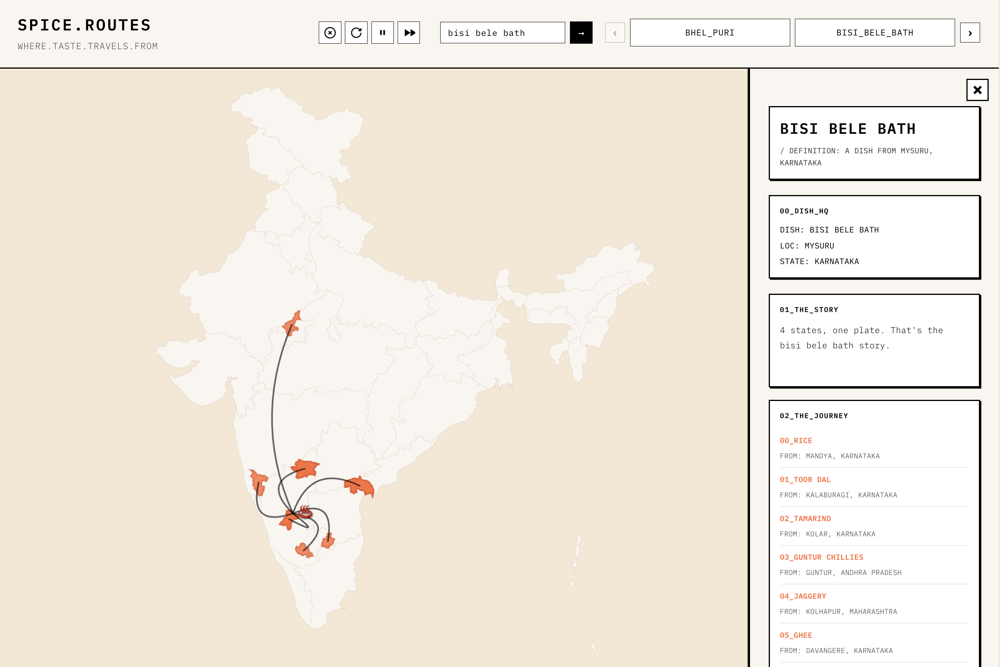

# 🍲 SPICE.ROUTES

**WHERE.TASTE.TRAVELS.FROM**



> *How did half of India end up in this one plate?*

An animated storytelling web app that visualizes how ingredients from different Indian regions converge into a single dish. Watch as spices, grains, and flavors journey across the map to tell the geographic story behind your favorite Indian dishes.

---

## ✨ What It Does

Enter a dish name. Watch the magic unfold:

1. **AI identifies** the key ingredients (5-10 meaningful ones, no water-from-Ganges nonsense)
2. **Maps each ingredient** to its geographic origin (district-level precision!)
3. **Animates the journey** as ingredients "travel" from source regions to the dish's origin
4. **Tells the story** with witty, Bill Wurtz-style commentary

The result? A beautiful, educational visualization that answers: *"How did half of India end up in this one plate?"*

---

## 🎯 Features

- **🗺️ District-Level Visualization**: Precise geographic mapping with district highlights
- **🎬 Smooth Animations**: D3.js-powered zoom, pan, and path animations
- **💬 Witty Commentary**: Fast-paced, pun-filled narration (Bill Wurtz vibes)
- **📱 Mobile-First Design**: Collapsible info panel, optimized touch targets, responsive layout
- **⚡ Instant Results**: Cached suggestions for popular dishes (no LLM wait time)
- **🎨 Minimalist Aesthetic**: IBM Plex Mono font, Hermès orange accents, clean UI

---

## 🚀 Quick Start

### Prerequisites

- Node.js 18+ and npm
- A Gemini API key ([Get one here](https://aistudio.google.com/app/apikey))

### Local Development

1. **Clone the repository**
   ```bash
   git clone <your-repo-url>
   cd spice-routes
   ```

2. **Install dependencies**
   ```bash
   npm install
   ```

3. **Set up environment variables**
   ```bash
   cp env.example .env
   # Edit .env and add your GEMINI_API_KEY
   ```

4. **Start the backend** (Terminal 1)
   ```bash
   npm run dev:api
   # or: vercel dev
   ```

5. **Start the frontend** (Terminal 2)
   ```bash
   npm run dev
   ```

6. **Open your browser**
   ```
   http://localhost:5173
   ```

> 💡 **Tip**: You need both terminals running! The backend handles API calls, the frontend serves the UI.

### Production Deployment

See [DEPLOYMENT.md](./DEPLOYMENT.md) for detailed Vercel deployment instructions.

---

## 🛠️ Tech Stack

- **Frontend**: Vanilla TypeScript + Vite
- **Visualization**: D3.js (SVG rendering, geo projections, animations)
- **Map Data**: TopoJSON (India state & district boundaries)
- **Backend**: Vercel Serverless Functions
- **AI**: Google Gemini 2.5 Flash API
- **Styling**: Pure CSS (mobile-first, responsive)

---

## 📁 Project Structure

```
spice-routes/
├── api/                    # Vercel serverless functions
│   ├── dish.ts            # Main dish analysis endpoint
│   ├── suggestions.ts     # Cached suggestions endpoint
│   └── seed-cache.json    # Pre-computed popular dishes
├── src/
│   ├── main.ts            # App entry point & UI logic
│   ├── animation.ts       # D3.js animation engine
│   ├── map.ts             # Map utilities & district resolution
│   ├── api-client.ts      # Frontend API client
│   ├── domain.ts          # TypeScript interfaces
│   └── styles.css         # Styling (mobile-first)
├── public/
│   ├── india.json         # TopoJSON India map data
│   └── state2district_list.json  # District mapping data
└── media/
    └── cover_img.png      # Project cover image
```

---

## 🔒 Security

**Your API key is secure!** 

- ✅ Stored server-side only (Vercel environment variables)
- ✅ Never exposed to the frontend
- ✅ Only used in serverless functions
- ✅ Not visible in browser network requests

The frontend makes requests to `/api/dish`, which then securely calls Gemini API on the server. Your key never leaves Vercel's infrastructure.

---

## 🎨 Design Philosophy

**Minimalist. Functional. Fun.**

- **Typography**: IBM Plex Mono (monospace, developer-friendly)
- **Color Palette**: Hermès orange accents on cream/beige backgrounds
- **Layout**: Mobile-first, collapsible panels, touch-optimized
- **Animation**: Smooth, purposeful, not distracting

Inspired by the clean, terminal-like aesthetic of modern developer tools, but with a playful twist.

---

## 📚 Documentation

- **[DEPLOYMENT.md](./DEPLOYMENT.md)** - Deploy to Vercel
- **[LOCAL_SETUP.md](./LOCAL_SETUP.md)** - Detailed local development guide
- **[BACKEND_SETUP.md](./BACKEND_SETUP.md)** - Backend architecture overview
- **[CACHE_AND_DISTRICTS.md](./CACHE_AND_DISTRICTS.md)** - Caching & district resolution
- **[QUICK_START.md](./QUICK_START.md)** - Quick troubleshooting guide

---

## 🎯 How It Works

1. **User enters dish name** → Frontend sends to `/api/dish`
2. **Backend checks cache** → Returns instantly if cached
3. **If not cached** → Calls Gemini API (2-stage process):
   - Stage 1: Identify ingredients & origins
   - Stage 2: Resolve exact districts from place names
4. **Backend caches result** → Saves to JSON file for future requests
5. **Frontend receives data** → Renders map, animates paths, shows commentary
6. **Suggestions update** → New dish appears in carousel

---

## 🐛 Known Limitations

- **Approximate accuracy**: Ingredient origins are AI-inferred, not historically rigorous
- **District resolution**: Some place names may not resolve to exact districts
- **Cache persistence**: Vercel `/tmp` is ephemeral (cache resets on deployment)
- **No user accounts**: Stateless, single-session use

---

## 🤝 Contributing

Found a bug? Have an idea? Feel free to:
- Open an issue
- Submit a PR
- Share feedback

This is a fun project—contributions welcome! 🎉

---

## 📄 License

MIT License - Use it, modify it, make it your own.

---

## Credits & Acknowledgments

### Map Data
- **India TopoJSON**: [udit-001/india-maps-data](https://github.com/udit-001/india-maps-data)
  - State and district boundaries
  - Geographic coordinate data

### Design Inspiration
- **Visual Aesthetic**: Inspired by [@vamsibatchuk's wanderword app](https://x.com/vamsibatchuk/status/2013028659938947184)


### Code Generation
- **Built with**: [Cursor](https://cursor.sh) + an ensemble of LLMs
  - Pair programming with AI assistants
  - Iterative refinement and debugging
  - *Yes, the robots helped write this. They're pretty good at it.*

### AI & APIs
- **Gemini 2.5 Flash**: Google's Gemini API for ingredient analysis
- **D3.js**: Mike Bostock's incredible visualization library

---

## 💭 The Story Behind SPICE.ROUTES

Every dish tells a story. A story of geography, culture, trade routes, and migration. SPICE.ROUTES makes that story visible.

What started as a weekend project to visualize ingredient origins became a journey through Indian geography, food culture, and the art of storytelling through code.

*Because sometimes, the best way to understand a place is through its food.*

---

**Made with 🍛 and ❤️**

*"How did half of India end up in this one plate?"* — Now you know.
